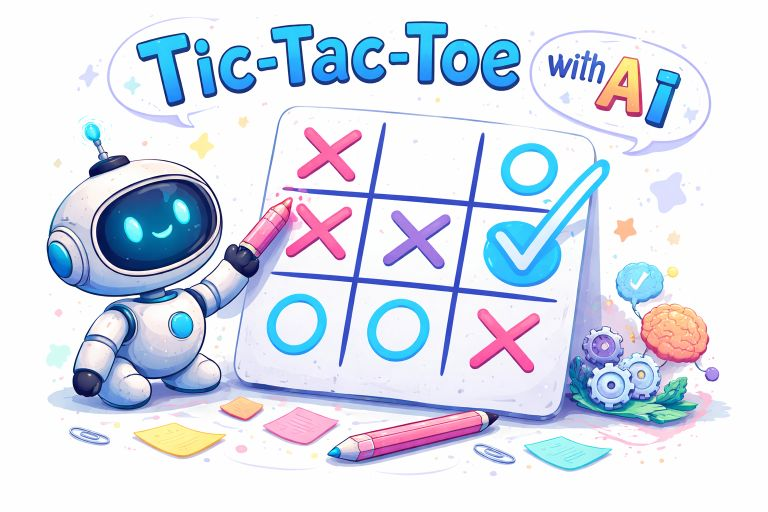

# Tic-Tac-Toe — AI Vision Player



A single-file browser game where you play Tic-Tac-Toe against a **local vision LLM** running in [LM Studio](https://lmstudio.ai).  
After every human move the game captures a **screenshot of the board**, sends it to the model, and the model replies with JSON specifying its next move.

---

## How It Works

```
Human clicks cell
       │
       ▼
 Board updated (X placed)
       │
       ▼
 html2canvas → PNG screenshot of the board
       │
       ▼
 POST /v1/chat/completions  ←─ LM Studio local server
   • system prompt (game rules + output format)
   • user message  (board image + instruction)
       │
       ▼
 LLM response → JSON { "row": n, "col": n }
       │
       ▼
 JavaScript places O on the board
       │
       ▼
 Win / draw check → repeat
```

No backend required — everything runs in the browser.

---

## Requirements

| Requirement | Notes |
|---|---|
| **LM Studio** ≥ 0.3 | [lmstudio.ai](https://lmstudio.ai) |
| **Vision-capable model** | LLaVA-1.6, BakLLaVA, MiniCPM-V, Qwen2-VL, InternVL, etc. |
| **Local Server enabled** | Start it inside LM Studio → _Local Server_ tab |
| **CORS allowed** | Enable _Allow CORS_ in LM Studio server settings |
| Modern browser | Chrome, Firefox, Edge (no IE) |

---

## Quick Start

1. **Clone / download** this repository.
2. **Open LM Studio**, load a vision model, start the local server (default port `1234`), and enable CORS.
3. **Open `index.html`** directly in your browser (no web server needed — `file://` works).
4. *(Optional)* Expand the **LM Studio Settings** panel and adjust:
   - **API Base URL** — change if your LM Studio runs on a different port.
   - **Model Identifier** — use the exact model name shown in LM Studio, or leave as `local-model`.
   - **Temperature** — lower values (`0.1`) make the AI more deterministic.
5. Click any cell to place your **X** and start the game.

---

## File Structure

```
ai-playground-tic-tac-toe/
└── index.html      # Everything: XHTML markup, CSS, JavaScript
└── README.md       # This file
```

The game is intentionally a **single self-contained file** — no build step, no npm, no dependencies beyond the `html2canvas` CDN script.

---

## Game Features

- **You play as X** (blue crosses), **AI plays as O** (purple circles).
- Winning cells light up in green when the game ends.
- Score board tracks wins, losses, and draws across multiple games.
- A thumbnail of the last screenshot and the raw LLM response are shown below the board for debugging.
- If the LLM returns an invalid or occupied cell the error is shown in the status bar and your turn is restored — the game never gets stuck.

---

## System Prompt

The vision LLM receives the following system prompt on every turn:

> You are a strategic Tic-Tac-Toe player. You play as 'O'.  
> (full rules, board coordinate explanation, visual encoding description)  
> Respond **only** with: `{"row": <0-2>, "col": <0-2>}`

The complete prompt is defined in `SYSTEM_PROMPT` inside `index.html` and can be freely edited.

---

## Troubleshooting

| Symptom | Likely cause | Fix |
|---|---|---|
| `Failed to fetch` | LM Studio not running | Start the local server in LM Studio |
| `HTTP 404` | Wrong API URL | Check the base URL in Settings |
| `No valid JSON found` | Model does not follow instructions well | Try a different model or lower the temperature |
| `Cell already occupied` | Model chose an occupied cell | The game retries your turn; consider a smarter model |
| Board screenshot is blank | `html2canvas` CDN blocked | Allow the CDN or serve via a local web server |

---

## License

MIT — do whatever you like with it.
